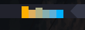
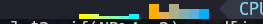

# tmux-plugin-gpu
Show gpu utilization rate &amp; gpu memory used percent by histogram. It can be adjusted with the change of the hostname (connect to other nodes via `ssh`).

Default show all GPUs ( not more than 6 )





## Requirements

* nvidia-smi
  ```shell
  # Enable the persistence mode
  sudo nvidia-smi -pm 1
  ```

* awk

* [SSH login without password](https://www.ibm.com/support/pages/configuring-ssh-login-without-password)

## Installation

Installation with [Tmux Plugin Manager](https://github.com/tmux-plugins/tpm)

Add plugin to the list of TPM plugins in `.tmux.conf`:

```
set -g @plugin 'matln/tmux-plugin-gpu'
```

Hit `prefix + I` to fetch the plugin and source it.

## Usage

add the following command to your `.tmux.conf` file:

```bash
#{gpu_rainbow}            # gpu utilization
#{gpu_mem}                # gpu memory used
```

## Configuration

* change background color of the bar in your `.tmux.conf`
```bash
set -g @gpu_bar_bg '#21222C'            # gpu utilization. Default: #21222C
set -g @gpu_mem_bar_bg '#21222C'        # gpu memory used. Default: #21222C
```

* Foreground color will be changed according to the utilization rate. The larger the utilization rate, the darker the color. You can change thresholds in your `.tmux.conf`

```bash
# gpu utilization rate
set -g @gpu_medium_threshold "10"         # Default: 10
set -g @gpu_stress_threshold "90"         # Default: 99

# gpu memory used
set -g @gpu_mem_medium_threshold "50"     # Default: 50
set -g @gpu_mem_stress_threshold "90"     # Default: 90
```

## Reference
https://github.com/samoshkin/tmux-plugin-sysstat
